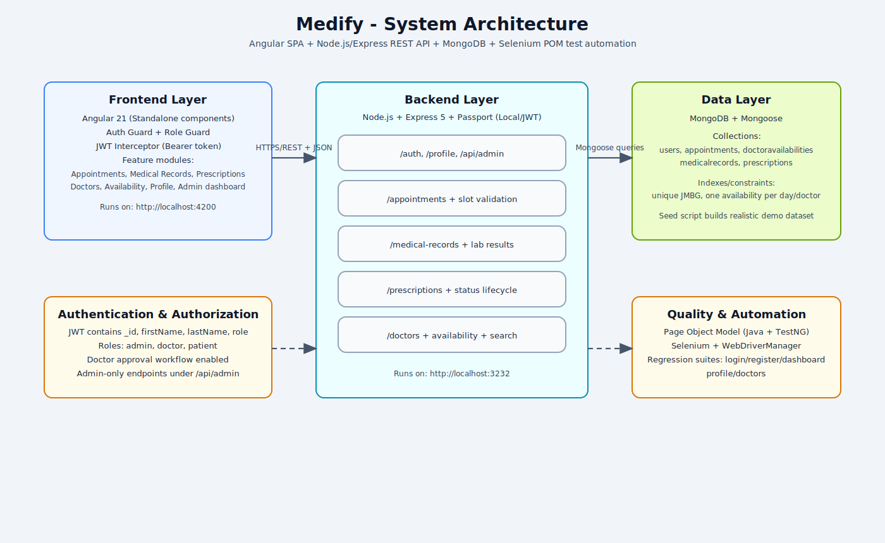

# Medify

Medify je full-stack informacioni sistem za upravljanje ordinacijom nad 3 ključne operacije:

- rad sa korisnicima i ulogama (admin, doctor, patient)
- klinički tok (termini, kartoni, recepti, dostupnost doktora)
- operativni nadzor kroz admin dashboard i audit pregled

U praksi, ideja Medify sistema je jednostavna: da doktorima i pacijentima skrati administraciju, a timu ordinacije donese jasniji pregled rada. Umesto rasutih informacija po više mesta, ključni podaci o pacijentu, terminima i terapiji nalaze se u jednom konzistentnom toku.

Repozitorijum je organizovan kao monorepo sa:

- Angular 21 frontend aplikacijom
- Node.js/Express 5 REST API backend-om
- MongoDB bazom podataka (Mongoose)
- Selenium + TestNG POM UI automatizacijom


## Zašto Medify

Medify je dizajniran tako da podrži svakodnevne procese jedne ordinacije, bez komplikovanja korisničkog iskustva.

- Za doktora: brz pregled rasporeda, lak unos kartona i direktno kreiranje recepta.
- Za pacijenta: jasan uvid u termine, istoriju pregleda i terapiju.
- Za admina: centralno mesto za kontrolu korisnika, odobrenja i operativnih metrika.

## Arhitektura sistema



Slika prikazuje kako frontend, backend i baza rade kao jedinstven sistem: Angular aplikacija komunicira sa REST API slojem, dok backend orkestrira poslovna pravila i pristup podacima u MongoDB.

## Tehnološki stack

### Backend

- Node.js
- Express 5
- Passport Local + Passport JWT
- jsonwebtoken
- Mongoose
- CORS

### Frontend

- Angular 21 (standalone komponente)
- TypeScript
- RxJS
- Angular Router + route guards
- HTTP interceptor za JWT

### Test automation

- Java 21
- Maven
- Selenium WebDriver
- TestNG
- WebDriverManager

## Struktura repozitorijuma

```text
Medify/
  README.md
  docs/
    architecture/
      medify-architecture.svg
  backend/
    config.js
    index.js
    middleware/
    models/
    routes/
    scripts/
    services/
  frontend/
    angular.json
    package.json
    src/
      app/
      environments/
  page-object-model/
    pom.xml
    testng.xml
    src/
      main/java/
      test/java/
```

## Poslovne uloge i pristup

Sistem podržava tri uloge definisane u modelu korisnika i auth konfiguraciji:

- `admin`
- `doctor`
- `patient`

Ključna pravila iz implementacije:

- doktor nalozi ulaze u approval tok (`approvalStatus: pending`) i tek nakon odobrenja imaju pun pristup
- admin i patient su inicijalno odobreni
- JWT payload sadrži `_id`, `firstName`, `lastName`, `role` i `exp`
- frontend čuva token i osnovne user podatke u localStorage (`medify_token`, `medify_user`)

Na ovaj način je razdvojeno ko šta može da radi, ali je korisnički tok i dalje prirodan: nakon uspešne prijave korisnik vidi samo ono što je relevantno za njegovu ulogu.

## Funkcionalni opseg

U nastavku je pregled funkcionalnosti po domenima, onako kako su implementirane u kodu i API sloju.

### 1) Autentifikacija i korisnici

- registracija korisnika sa validacijom obaveznih polja
- login sa Passport Local strategijom
- JWT token validacija endpoint (`GET /auth/validate-token`)
- admin CRUD nad korisnicima

### 2) Termini

- zakazivanje termina od strane doktora i pacijenata
- validacija dostupnog vremenskog slota doktora pre kreiranja termina
- statusi termina: `scheduled`, `completed`, `canceled`
- filtriranje po statusu za doctor/patient prikaze

### 3) Medicinski kartoni

- doktor kreira karton po pacijentu
- karton može biti povezan sa terminom
- podrška za vital signs, nalaze i follow-up datum
- dodatno API proširenje za laboratorijske rezultate

### 4) Recepti

- doktor kreira recept sa listom lekova
- recept se opciono vezuje za karton i termin
- statusi recepta: `active`, `completed`, `cancelled`
- endpoint za aktivne recepte pacijenta

### 5) Dostupnost doktora

- definisanje radnih intervala po danu u nedelji
- podrška za pauze (`breakStart`, `breakEnd`)
- podrška za smene preko ponoći
- automatsko generisanje default dostupnosti na osnovu doctor shift-a

### 6) Admin modul

- agregirani dashboard sa statistikama
- odobravanje/odbijanje naloga
- aktivacija/deaktivacija naloga
- audit pregled nedavnih aktivnosti

Kombinacija ovih modula omogućava da se ceo ciklus rada, od zakazivanja do evidencije terapije, prati u jedinstvenom sistemu.

## API mapa

### Root

- `GET /` opis sistema
- `GET /test` health-like test endpoint

### Auth (`/auth`)

- `POST /auth/register`
- `POST /auth/login`
- `GET /auth/validate-token`
- `GET /auth/users` (admin)
- `GET /auth/users/:id` (admin)
- `PUT /auth/users/:id` (admin)
- `DELETE /auth/users/:id` (admin)

### Profile (`/profile`)

- `GET /profile` trenutno ulogovan korisnik
- `PUT /profile` izmena sopstvenog profila

### Appointments (`/appointments`)

- `POST /appointments`
- `GET /appointments/all` (admin)
- `GET /appointments/doctor` (doctor)
- `GET /appointments/patient` (patient)
- `GET /appointments/:id`
- `PUT /appointments/:id/status`
- `PUT /appointments/:id`
- `DELETE /appointments/:id`

### Medical records (`/medical-records`)

- `GET /medical-records/all` (admin)
- `POST /medical-records` (doctor)
- `GET /medical-records/patient/:patientId`
- `GET /medical-records/doctor/:doctorId`
- `GET /medical-records/:id`
- `PUT /medical-records/:id` (doctor/admin)
- `POST /medical-records/:id/lab-results` (doctor/admin)
- `DELETE /medical-records/:id` (doctor/admin)

### Prescriptions (`/prescriptions`)

- `GET /prescriptions/all` (admin)
- `POST /prescriptions` (doctor)
- `GET /prescriptions/patient/:patientId/active`
- `GET /prescriptions/patient/:patientId`
- `GET /prescriptions/:id`
- `PUT /prescriptions/:id/status`
- `DELETE /prescriptions/:id`

### Doctors (`/doctors`)

- `POST /doctors/:id/availability` (doctor/admin)
- `POST /doctors/:id/availability/generate-default` (doctor/admin)
- `GET /doctors/:id/available-slots`
- `GET /doctors/:id/availability`
- `PUT /doctors/availability/:availabilityId` (doctor/admin)
- `DELETE /doctors/availability/:availabilityId` (doctor/admin)
- `GET /doctors/search`
- `GET /doctors`
- `GET /doctors/:id`

### Admin (`/api/admin`)

- `GET /api/admin/dashboard`
- `POST /api/admin/approve-user/:userId`
- `POST /api/admin/reject-user/:userId`
- `POST /api/admin/toggle-user/:userId`
- `GET /api/admin/audit-log`

## Model podataka (sažetak)

### User

- identitet: `JMBG`, `firstName`, `lastName`, `gender`, `dateOfBirth`
- sigurnost: `passwordHash`, `passwordSalt`
- pristup: `role`, `isApproved`, `approvalStatus`, `isActive`
- doctor polja: `specialization`, `licenseNumber`, `yearsOfExperience`, `officeNumber`, `shift`
- patient polja: `bloodType`, `allergies`, `insuranceNumber`, `insuranceCompany`

### Appointment

- veze: `doctor`, `patient`
- ključna polja: `appointmentDate`, `reason`, `status`

### MedicalRecord

- veze: `patient`, `doctor`, opciono `appointment`
- klinički sadržaj: `diagnosis`, `symptoms`, `examinationNotes`, `treatment`, `recommendations`, `vitalSigns`, `labResults`

### Prescription

- veze: `patient`, `doctor`, opciono `medicalRecord`, `appointment`
- terapija: `medications[]`, `validUntil`, `status`, `notes`

### DoctorAvailability

- veza: `doctor`
- raspored: `dayOfWeek`, `startTime`, `endTime`, `breakStart`, `breakEnd`, `appointmentDuration`
- jedinstvenost: jedan zapis po doktoru i danu (`doctor + dayOfWeek`)

## Preduslovi

- Node.js 18+
- npm
- MongoDB (lokalno ili cloud)
- Java 21
- Maven 3.9+
- Google Chrome (za Selenium suite)

## Instalacija i pokretanje (lokalni razvoj)

Lokalno podizanje projekta je podeljeno u četiri jasna koraka i može se završiti za nekoliko minuta.

### 1) Backend

```bash
cd backend
npm install
npm start
```

Backend default URL: `http://localhost:3232`

### 2) Frontend

```bash
cd frontend
npm install
npm start
```

Frontend default URL: `http://localhost:4200`

### 3) Seed podaci

Iz foldera `backend/`:

```bash
npm run seed
```

Reset + seed:

```bash
npm run seed:reset
```

`seed:reset` briše sve kolekcije i generiše realističan demo dataset (korisnici, dostupnosti, istorijski i budući termini, kartoni, recepti).

### 4) UI automation (POM)

```bash
cd page-object-model
mvn test -Dsurefire.suiteXmlFiles=testng.xml
```

Napomena: za uspešan run testova potrebno je da backend i frontend budu aktivni i da seed podaci postoje.

## Konfiguracija

### Backend konfiguracija

Fajl: `backend/config.js`

- `PORT` (default `3232`)
- `MongoConnection` (default `mongodb://localhost:27017/Medify`)
- `secret` (JWT secret)

### Frontend API konfiguracija

Fajl: `frontend/src/environments/environment.ts`

- `apiUrl` (default `http://localhost:3232`)

## Frontend ruta mapa

Javne rute:

- `/login`
- `/register`

Zaštićene rute (`authGuard(true)`):

- `/dashboard`
- `/appointments`
- `/medical-records`
- `/prescriptions`
- `/doctors`
- `/doctors/:id`
- `/profile`

Role-restricted rute:

- doctor: `/availability`
- admin: `/users`, `/admin/dashboard`, `/admin/appointments`, `/admin/medical-records`, `/admin/prescriptions`, `/admin/statistics`

## Test kredencijali (iz seed skripte)

- admin: `1001001001001` / `Admin123!`
- doctor: `3003003003003` / `Doctor123!`
- doctor: `4004004004004` / `Doctor123!`
- patient: `5005005005005` / `Patient123!`
- patient: `6006006006006` / `Patient123!`

## Bezbednosne i operativne napomene

- CORS je trenutno podešen na frontend origin `http://localhost:4200`
- u razvojnom režimu je JWT secret hardkodovan u `backend/config.js` i treba ga zameniti environment promenljivama pre produkcije
- backend autentifikacija i autorizacija su centralizovane kroz Passport i middleware zaštitu ruta

## Troubleshooting

Ako nešto ne radi iz prve, sekcija ispod pokriva najčešće situacije i brza rešenja.

### Frontend ne komunicira sa backend-om

- proveriti da backend radi na portu iz `frontend/src/environments/environment.ts`
- proveriti CORS origin podešavanje u `backend/index.js`

### Login/guard loop

- proveriti validnost tokena preko `GET /auth/validate-token`
- proveriti da li je token u localStorage (`medify_token`)

### Nema dostupnih termina doktora

- proveriti da li doktor ima dostupnosti (`GET /doctors/:id/availability`)
- po potrebi generisati default dostupnost (`POST /doctors/:id/availability/generate-default`)

### Admin dashboard vraća 403

- proveriti da li je korisnik u ulozi `admin`
- proveriti da frontend poziva `/api/admin/*` rute

---

Medify je pravljen sa puno pažnje, truda i želje da bude što bolji💕. 
