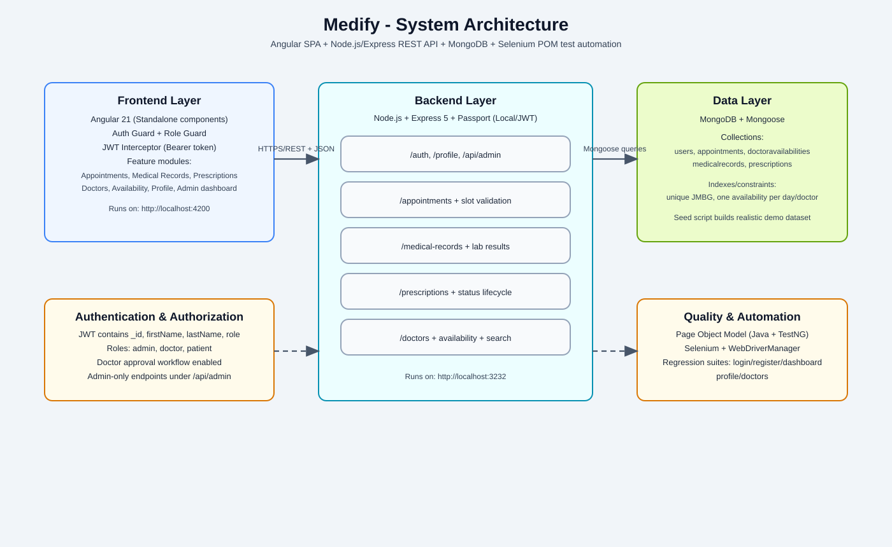

# Medify

Medify je full-stack informacioni sistem za upravljanje ordinacijom nad 3 ključne operacije:

- rad sa korisnicima i ulogama (admin, doctor, patient)
- klinički tok (termini, kartoni, recepti, dostupnost doktora)
- operativni nadzor kroz admin dashboard i audit pregled

U praksi, ideja Medify sistema je jednostavna: da doktorima i pacijentima skrati administraciju, a timu ordinacije donese jasniji pregled rada. Umesto rasutih informacija po više mesta, ključni podaci o pacijentu, terminima i terapiji nalaze se u jednom konzistentnom toku.

Repozitorijum je organizovan kao monorepo sa:

- Angular 21 frontend aplikacijom
- Node.js/Express 5 REST API backend-om
- MongoDB bazom podataka (Mongoose)
- Selenium + TestNG POM UI automatizacijom


## Zašto Medify

Medify je dizajniran tako da podrži svakodnevne procese jedne ordinacije, bez komplikovanja korisničkog iskustva.

- Za doktora: brz pregled rasporeda, lak unos kartona i direktno kreiranje recepta.
- Za pacijenta: jasan uvid u termine, istoriju pregleda i terapiju.
- Za admina: centralno mesto za kontrolu korisnika, odobrenja i operativnih metrika.

## Arhitektura sistema



Slika prikazuje kako frontend, backend i baza rade kao jedinstven sistem: Angular aplikacija komunicira sa REST API slojem, dok backend orkestrira poslovna pravila i pristup podacima u MongoDB.

## Tehnološki stack

### Backend

- Node.js
- Express 5
- Socket.io (real-time event bus)
- Passport Local + Passport JWT
- jsonwebtoken
- Mongoose
- CORS

### Frontend

- Angular 21 (standalone komponente)
- TypeScript
- RxJS
- Socket.io client
- Angular Router + route guards
- HTTP interceptor za JWT

### Test automation

- Java 21
- Maven
- Selenium WebDriver
- TestNG
- WebDriverManager

## Struktura repozitorijuma

```text
Medify/
  README.md
  docs/
    architecture/
      medify-architecture.svg
  backend/
    config.js
    index.js
    middleware/
    models/
    routes/
    scripts/
    services/
  frontend/
    angular.json
    package.json
    src/
      app/
      environments/
  page-object-model/
    pom.xml
    testng.xml
    src/
      main/java/
      test/java/
```

## Poslovne uloge i pristup

Sistem podržava tri uloge definisane u modelu korisnika i auth konfiguraciji:

- `admin`
- `doctor`
- `patient`

Ključna pravila iz implementacije:

- doktor nalozi ulaze u approval tok (`approvalStatus: pending`) i tek nakon odobrenja imaju pun pristup
- admin i patient su inicijalno odobreni
- JWT payload sadrži `_id`, `firstName`, `lastName`, `role` i `exp`
- frontend čuva token i osnovne user podatke u localStorage (`medify_token`, `medify_user`)

Na ovaj način je razdvojeno ko šta može da radi, ali je korisnički tok i dalje prirodan: nakon uspešne prijave korisnik vidi samo ono što je relevantno za njegovu ulogu.

## Funkcionalni opseg

U nastavku je pregled funkcionalnosti po domenima, onako kako su implementirane u kodu i API sloju.

### 1) Autentifikacija i korisnici

- registracija korisnika sa validacijom obaveznih polja
- login sa Passport Local strategijom
- JWT token validacija endpoint (`GET /auth/validate-token`)
- admin CRUD nad korisnicima

### 2) Termini

- zakazivanje termina od strane doktora i pacijenata
- validacija dostupnog vremenskog slota doktora pre kreiranja termina
- statusi termina: `scheduled`, `completed`, `canceled`
- filtriranje po statusu za doctor/patient prikaze

### 3) Medicinski kartoni

- doktor kreira karton po pacijentu
- karton može biti povezan sa terminom
- podrška za vital signs, nalaze i follow-up datum
- dodatno API proširenje za laboratorijske rezultate

### 4) Recepti

- doktor kreira recept sa listom lekova
- recept se opciono vezuje za karton i termin
- statusi recepta: `active`, `completed`, `cancelled`
- endpoint za aktivne recepte pacijenta

### 5) Dostupnost doktora

- definisanje radnih intervala po danu u nedelji
- podrška za pauze (`breakStart`, `breakEnd`)
- podrška za smene preko ponoći
- automatsko generisanje default dostupnosti na osnovu doctor shift-a

### 6) Admin modul

- agregirani dashboard sa statistikama
- odobravanje/odbijanje naloga
- aktivacija/deaktivacija naloga
- audit pregled nedavnih aktivnosti

Kombinacija ovih modula omogućava da se ceo ciklus rada, od zakazivanja do evidencije terapije, prati u jedinstvenom sistemu.

### 7) Real-time obaveštenja (globalno)

Uveden je Socket.io sloj koji omogućava trenutnu isporuku obaveštenja bez osvežavanja stranice.

Ključna promena je da obaveštenja više nisu vezana samo za ekran termina, već su dostupna globalno, na bilo kom ekranu gde je korisnik prijavljen.

Implementirani tok:

- backend emituje događaje pri zakazivanju i promeni statusa termina
- frontend centralizovano prikuplja događaje kroz globalni notification store
- layout prikazuje globalni toast na svim zaštićenim rutama
- stranica `/notifications` prikazuje listu aktuelnih obaveštenja (read/unread, clear)

Najvažniji tehnički detalji:

- JWT za socket handshake koristi isti token iz Auth servisa (`medify_token`)
- Socket konekcija se automatski aktivira nakon login-a i gasi nakon logout-a
- backend emituje ciljano ka relevantnim učesnicima (doctor/patient), ne broadcast ka svima
- frontend čuva obaveštenja po korisniku u localStorage ključu `medify_notifications_<userId>`

Relevantne implementacije:

- backend: `backend/socket/*`, `backend/routes/appointment.js`
- frontend socket lifecycle: `frontend/src/app/services/socket.service.ts`
- frontend global store: `frontend/src/app/services/notification-store.service.ts`
- globalni UI prikaz: `frontend/src/app/components/layout/*`
- stranica obaveštenja: `frontend/src/app/components/notifications/*`

## API mapa

### Root

- `GET /` opis sistema

## Kritična bezbednosna ispravka: odbijeni doktor ne sme biti zakaziv

Ova ispravka rešava visokorizičan scenario u kome je doktor sa statusom `rejected` ostajao vidljiv u listama i potencijalno dostupan za zakazivanje.

### Problem koji je postojao

- admin odbije doktora (`approvalStatus = rejected`, `isApproved = false`)
- pacijent ga i dalje vidi kroz `/doctors` i `/doctors/search`
- kroz pojedine tokove je bilo moguće pokušati zakazivanje termina

### Implementirani guardrails

Sada je kroz backend uvedeno jedinstveno pravilo da doktor mora ispunjavati sva 4 uslova da bi bio "bookable":

- `role = doctor`
- `isActive = true`
- `isApproved = true`
- `approvalStatus = approved`

Ključna implementacija:

- shared helper: `backend/utils/doctorEligibility.js`
- booking provera: `backend/routes/appointment.js`
- query filtriranje doktora: `backend/routes/doctor.js`

### Efekat po endpointima

- `GET /doctors` vraća samo aktivne i odobrene doktore
- `GET /doctors/search` pretražuje samo aktivne i odobrene doktore
- `GET /doctors/:id` vraća detalj samo ako je doktor aktivan i odobren
- `GET /doctors/:id/available-slots` vraća slotove samo za aktivnog i odobrenog doktora
- `POST /appointments` blokira kreiranje termina ako doktor nije aktivan i odobren

Na ovaj način je bug zatvoren na backend nivou (source of truth), pa UI više ne zavisi od "dobre volje" klijenta niti od front-end filtriranja.

### Auth (`/auth`)

- `POST /auth/register`
- `POST /auth/login`
- `GET /auth/validate-token`
- `GET /auth/users` (admin)
- `GET /auth/users/:id` (admin)
- `PUT /auth/users/:id` (admin)
- `DELETE /auth/users/:id` (admin)

### Profile (`/profile`)

- `GET /profile` trenutno ulogovan korisnik
- `PUT /profile` izmena sopstvenog profila

### Appointments (`/appointments`)

- `POST /appointments`
- `GET /appointments/all` (admin)
- `GET /appointments/doctor` (doctor)
- `GET /appointments/patient` (patient)
- `GET /appointments/:id`
- `PUT /appointments/:id/status`
- `PUT /appointments/:id`
- `DELETE /appointments/:id`

### Medical records (`/medical-records`)

- `GET /medical-records/all` (admin)
- `POST /medical-records` (doctor)
- `GET /medical-records/patient/:patientId`
- `GET /medical-records/doctor/:doctorId`
- `GET /medical-records/:id`
- `PUT /medical-records/:id` (doctor/admin)
- `POST /medical-records/:id/lab-results` (doctor/admin)
- `DELETE /medical-records/:id` (doctor/admin)

### Prescriptions (`/prescriptions`)

- `GET /prescriptions/all` (admin)
- `POST /prescriptions` (doctor)
- `GET /prescriptions/patient/:patientId/active`
- `GET /prescriptions/patient/:patientId`
- `GET /prescriptions/:id`
- `PUT /prescriptions/:id/status`
- `DELETE /prescriptions/:id`

### Doctors (`/doctors`)

- `POST /doctors/:id/availability` (doctor/admin)
- `POST /doctors/:id/availability/generate-default` (doctor/admin)
- `GET /doctors/:id/available-slots`
- `GET /doctors/:id/availability`
- `PUT /doctors/availability/:availabilityId` (doctor/admin)
- `DELETE /doctors/availability/:availabilityId` (doctor/admin)
- `GET /doctors/search`
- `GET /doctors`
- `GET /doctors/:id`

### Admin (`/api/admin`)

- `GET /api/admin/dashboard`
- `POST /api/admin/approve-user/:userId`
- `POST /api/admin/reject-user/:userId`
- `POST /api/admin/toggle-user/:userId`
- `GET /api/admin/audit-log`

## Model podataka (sažetak)

### User

- identitet: `JMBG`, `firstName`, `lastName`, `gender`, `dateOfBirth`
- sigurnost: `passwordHash`, `passwordSalt`
- pristup: `role`, `isApproved`, `approvalStatus`, `isActive`
- doctor polja: `specialization`, `licenseNumber`, `yearsOfExperience`, `officeNumber`, `shift`
- patient polja: `bloodType`, `allergies`, `insuranceNumber`, `insuranceCompany`

### Appointment

- veze: `doctor`, `patient`
- ključna polja: `appointmentDate`, `reason`, `status`

### MedicalRecord

- veze: `patient`, `doctor`, opciono `appointment`
- klinički sadržaj: `diagnosis`, `symptoms`, `examinationNotes`, `treatment`, `recommendations`, `vitalSigns`, `labResults`

### Prescription

- veze: `patient`, `doctor`, opciono `medicalRecord`, `appointment`
- terapija: `medications[]`, `validUntil`, `status`, `notes`

### DoctorAvailability

- veza: `doctor`
- raspored: `dayOfWeek`, `startTime`, `endTime`, `breakStart`, `breakEnd`, `appointmentDuration`
- jedinstvenost: jedan zapis po doktoru i danu (`doctor + dayOfWeek`)

## Preduslovi

- Node.js 18+
- npm
- MongoDB (lokalno ili cloud)
- Java 21
- Maven 3.9+
- Google Chrome (za Selenium suite)

## Instalacija i pokretanje (lokalni razvoj)

Lokalno podizanje projekta je podeljeno u četiri jasna koraka i može se završiti za nekoliko minuta.

### 1) Backend

```bash
cd backend
npm install
npm start
```

Backend default URL: `http://localhost:3232`

### 2) Frontend

```bash
cd frontend
npm install
npm start
```

Frontend default URL: `http://localhost:4200`

### 3) Seed podaci

Iz foldera `backend/`:

```bash
npm run seed
```

Reset + seed:

```bash
npm run seed:reset
```

`seed:reset` briše sve kolekcije i generiše realističan demo dataset (korisnici, dostupnosti, istorijski i budući termini, kartoni, recepti).

### 4) UI automation (Selenium POM)

```bash
cd page-object-model
mvn test -Dsurefire.suiteXmlFiles=testng.xml
```

Napomena: za uspešan run UI testova potrebno je da backend i frontend budu aktivni i da seed podaci postoje. Selenium testovi otvaraju realan Chrome browser, loguju se kroz stvarni frontend i proveravaju ponašanje aplikacije kroz korisnički interfejs.

## Konfiguracija

### Backend konfiguracija

Fajl: `backend/config.js`

- `PORT` (default `3232`)
- `MongoConnection` (default `mongodb://localhost:27017/Medify`)
- `secret` (JWT secret)

### Frontend API konfiguracija

Fajl: `frontend/src/environments/environment.ts`

- `apiUrl` (default `http://localhost:3232`)

## Frontend ruta mapa

Javne rute:

- `/login`
- `/register`

Zaštićene rute (`authGuard(true)`):

- `/dashboard`
- `/appointments`
- `/medical-records`
- `/prescriptions`
- `/doctors`
- `/doctors/:id`
- `/profile`
- `/notifications`

Role-restricted rute:

- doctor: `/availability`
- admin: `/users`, `/admin/dashboard`, `/admin/appointments`, `/admin/medical-records`, `/admin/prescriptions`, `/admin/statistics`

## Test kredencijali (iz seed skripte)

- admin: `1001001001001` / `Admin123!`
- doctor: `3003003003003` / `Doctor123!`
- doctor: `4004004004004` / `Doctor123!`
- patient: `5005005005005` / `Patient123!`
- patient: `6006006006006` / `Patient123!`

## Strategija testiranja i regresija

Medify koristi kombinaciju backend testova i UI end-to-end automatizacije. Cilj nije samo da se proveri da se stranice otvaraju, već da se potvrde realni korisnički tokovi: autentifikacija, autorizacija po ulogama, prikaz seed podataka, filtriranje, admin statistika i kritična pravila vezana za odobravanje doktora.

### Backend unit testovi

Backend testovi pokrivaju poslovna pravila koja moraju ostati tačna bez obzira na frontend. Najvažniji primer je pravilo podobnosti doktora za prikaz i zakazivanje.

Fajl:

- `backend/tests/doctorEligibility.test.js`

Pokriće:

- `isDoctorBookable = true` samo za aktivnog i odobrenog doktora
- `isDoctorBookable = false` za odbijenog doktora
- `isDoctorBookable = false` za neaktivnog doktora i za korisnika koji nije doktor
- `getApprovedDoctorQuery` uvek nameće filtere za aktivnog i odobrenog doktora

Pokretanje konkretnog backend testa:

```bash
cd backend
node --test tests/doctorEligibility.test.js
```

Pokretanje svih backend testova:

```bash
cd backend
node --test tests/**/*.test.js
```

### Selenium Page Object Model testovi

UI automatizacija se nalazi u folderu `page-object-model/` i koristi klasičan Page Object Model pristup:

- page object klase su u `page-object-model/src/main/java/pmf/imi/moodle`
- TestNG test klase su u `page-object-model/src/test/java/pmf/imi/moodle`
- zajednička baza za page object-e je `BasePageModel`
- suite konfiguracija je `page-object-model/testng.xml`
- WebDriver se podešava preko `WebDriverManager`
- testovi koriste realan Chrome browser i realne Angular rute

Page object sloj enkapsulira lokatore, akcije i eksplicitna čekanja. Test klase zato ostaju fokusirane na ponašanje sistema i poslovne asercije, a ne na detalje Selenium selektora.

### Pravila za stabilnost UI testova

Selenium testovi za Medify koriste `WebDriverWait` gde god UI zavisi od asinhronog ponašanja Angular aplikacije:

- čekanje da login forma bude renderovana pre unosa podataka
- čekanje da se završi `loading` stanje
- čekanje da se pojavi tabela, empty state ili error state
- čekanje promene URL-a posle login-a i klikova na brze linkove
- čekanje promene status filtera na admin stranicama
- zaštita od prolaznog `StaleElementReferenceException` tokom Angular re-rendera

Ovo je posebno važno jer Angular često uklanja i ponovo kreira elemente kada se promene signali (`signal`) ili kada API odgovor promeni stanje komponente.

### Preduslovi za POM suite

Pre pokretanja Selenium testova potrebno je da rade svi delovi sistema:

- backend: `http://localhost:3232`
- frontend: `http://localhost:4200`
- MongoDB baza sa seed podacima
- Java 21
- Maven 3.9+
- Google Chrome

Seed podaci su obavezni jer testovi koriste poznate kredencijale i očekuju realističan skup termina, korisnika, kartona i recepata.

Priprema podataka:

```bash
cd backend
npm run seed:reset
```

Zatim u odvojenim terminalima pokrenuti backend i frontend:

```bash
cd backend
npm start
```

```bash
cd frontend
npm start
```

### Pokretanje POM testova

Pokretanje celog TestNG suite-a:

```bash
cd page-object-model
mvn test -Dsurefire.suiteXmlFiles=testng.xml
```

Pokretanje pojedinačne test klase:

```bash
cd page-object-model
mvn -Dtest=LoginPageTest test
```

Pokretanje pojedinačnog test metoda:

```bash
cd page-object-model
mvn -Dtest=DoctorsPageTest#testRejectedDoctorIsNotVisibleInSearchResults test
```

Ako `mvn` komanda nije dostupna, potrebno je instalirati Maven ili pokrenuti testove direktno iz IDE-a preko TestNG run konfiguracije.

### Trenutni POM test suite

`testng.xml` trenutno uključuje sledeće regresione klase:

- `LoginPageTest`
- `RegisterPageTest`
- `DashboardPageTest`
- `AppointmentsPageTest`
- `MedicalRecordsPageTest`
- `PrescriptionsPageTest`
- `NotificationsPageTest`
- `ProfilePageTest`
- `DoctorsPageTest`
- `AvailabilityPageTest`
- `UsersPageTest`
- `AdminAppointmentsPageTest`
- `AdminDashboardPageTest`
- `AdminMedicalRecordsPageTest`
- `AdminPrescriptionsPageTest`
- `AdminStatisticsPageTest`

Suite se izvršava sekvencijalno (`parallel="false"`) zato što testovi koriste isti lokalni frontend/backend i seed bazu. Sekvencijalno izvršavanje smanjuje rizik od konflikta oko sesije, test podataka i stanja browser-a.

### Login stranica

Fajlovi:

- komponenta: `frontend/src/app/components/login/login.ts`
- šablon: `frontend/src/app/components/login/login.html`
- page object: `page-object-model/src/main/java/pmf/imi/moodle/LoginPage.java`
- testovi: `page-object-model/src/test/java/pmf/imi/moodle/LoginPageTest.java`

Testovi pokrivaju:

- naslov browser taba (`Medify`)
- heading-e `Medify` i `Prijavljivanje`
- inicijalno stanje forme
- `JMBG` input: `name`, `type`, `placeholder`, `required`
- `Lozinka` input: `name`, `type`, `placeholder`, `required`
- submit dugme `Prijavi se`
- validaciju prazne forme
- validaciju kada nedostaje lozinka
- validaciju kada nedostaje JMBG
- poruku `Molimo unesite JMBG i lozinku`
- pogrešnu lozinku za postojećeg korisnika
- pokušaj login-a za nepostojećeg korisnika
- čišćenje prethodne validacione greške pri novom submit-u
- navigaciju preko linka `Registrujte se`
- uspešan login i redirekciju na `/dashboard`

Važan tehnički detalj: test koji proverava promenu error poruke koristi čekanje koje ignoriše prolazni `StaleElementReferenceException`, jer Angular tokom promene signala može ukloniti stari `.error-message` element i renderovati novi.

### Appointments stranica

Fajlovi:

- komponenta: `frontend/src/app/components/appointments/appointments.ts`
- šablon: `frontend/src/app/components/appointments/appointments.html`
- modal šablon: `frontend/src/app/components/appointments/appointment-form-modal/appointment-form-modal.html`
- page object: `page-object-model/src/main/java/pmf/imi/moodle/AppointmentsPage.java`
- testovi: `page-object-model/src/test/java/pmf/imi/moodle/AppointmentsPageTest.java`

Testovi pokrivaju i patient i doctor prikaz iste stranice `/appointments`.

Pokriće za patient tok:

- login kao pacijent i otvaranje `/appointments`
- heading `Termini`
- dugme `Novi termin`
- odsustvo error state-a pri uspešnom učitavanju
- status filter opcije: `Svi statusi`, `Zakazani`, `Završeni`, `Otkazani`
- početna vrednost status filtera
- sort opcije: `Najnoviji prvo`, `Najstariji prvo`, `Status A-Z`
- početna vrednost sortiranja `dateDesc`
- prazna početna pretraga i prazni date filteri
- prikaz appointment kartica iz seed podataka
- osnovna struktura kartice: `Termin #`, `Doktor:`, `Datum:`, `Razlog:`
- filter `scheduled` i status `Zakazan`
- filter `completed` i status `Završen`
- filter `canceled` i status `Otkazan`
- odgovarajuće CSS klase status badge-a: `status-scheduled`, `status-completed`, `status-canceled`
- empty state `Nema termina` kada pretraga nema rezultat
- promena `dateFrom`, `dateTo` i `sortBy` kontrola
- reset filtera i sortiranja
- otvaranje i zatvaranje modala `Novi termin`
- patient modal kontrole: izbor doktora, datum, razlog pregleda

Pokriće za doctor tok:

- login kao doktor i otvaranje `/appointments`
- prikaz appointment kartica za doktora
- doctor kartica prikazuje `Pacijent:`, `Datum:` i `Razlog:`
- za zakazane termine proverava se prisustvo akcija `Završi termin` i `Otkaži`
- doctor modal koristi polje `Pacijent (JMBG)` umesto izbora doktora
- doctor modal prikazuje datum i razlog pregleda

Testovi ne kreiraju, ne završavaju i ne otkazuju termine. Time ostaju regresiono bezbedni i ne menjaju seed podatke, a ipak potvrđuju najvažnije delove UI-ja: listu termina, filtere, sortiranje, role-specific prikaz i modal za kreiranje.

Važan tehnički detalj: date input polja se podešavaju preko JavaScript `input` i `change` događaja, jer `type=date` može biti krhak u Selenium `sendKeys` pristupu zbog lokalizacije browser-a.

### Admin appointments stranica

Fajlovi:

- komponenta: `frontend/src/app/components/admin/admin-appointments/admin-appointments.ts`
- šablon: `frontend/src/app/components/admin/admin-appointments/admin-appointments.html`
- page object: `page-object-model/src/main/java/pmf/imi/moodle/AdminAppointmentsPage.java`
- testovi: `page-object-model/src/test/java/pmf/imi/moodle/AdminAppointmentsPageTest.java`

Testovi se loguju kao admin korisnik i otvaraju `/admin/appointments`.

Pokriće:

- heading `Svi termini`
- potvrda admin URL-a `/admin/appointments`
- status filter i opcije `Svi statusi`, `Zakazani`, `Završeni`, `Otkazani`
- inicijalna vrednost filtera
- kolone tabele: `ID`, `Doktor`, `Pacijent`, `Datum`, `Razlog`, `Status`
- prikaz svih termina iz seed podataka
- odsustvo error state-a kada API uspešno vrati podatke
- filter `scheduled` i prikaz statusa `Zakazan`
- filter `completed` i prikaz statusa `Završen`
- filter `canceled` i prikaz statusa `Otkazan`
- odgovarajuće CSS klase status badge-a: `status-scheduled`, `status-completed`, `status-canceled`
- povratak filtera na `Svi statusi`
- empty state `Nema termina sa odabranim filterima` ako za izabrani filter nema rezultata

Ova stranica je dobar primer UI testa koji proverava i podatke i prezentacionu logiku: isti API rezultat se filtrira na klijentu kroz `statusFilter` signal, pa test potvrđuje da se tabela stvarno menja nakon izbora iz `<select>` elementa.

### Medical records stranica

Fajlovi:

- komponenta: `frontend/src/app/components/medical-records/medical-records.ts`
- šablon: `frontend/src/app/components/medical-records/medical-records.html`
- page object: `page-object-model/src/main/java/pmf/imi/moodle/MedicalRecordsPage.java`
- testovi: `page-object-model/src/test/java/pmf/imi/moodle/MedicalRecordsPageTest.java`

Pokriće:

- patient login i otvaranje `/medical-records`
- heading `Medicinski kartoni`
- sort opcije `Najnoviji prvo`, `Najstariji prvo`, `Dijagnoza A-Z`
- prikaz kartica medicinskih kartona iz seed podataka
- osnovna struktura kartice: `Karton #`, `Dijagnoza:`
- patient prikaz ne prikazuje dodatnu labelu `Pacijent:`
- search empty state `Nema medicinskih kartona`
- promena i reset search/date/sort filtera
- doctor login i otvaranje doctor-only modala `Kreiraj medicinski karton`
- modal polja `ID Pacijenta *` i `Dijagnoza *`

Testovi ne kreiraju medicinski karton, već proveravaju prikaz, filtere i bezbedno otvaranje doctor-only forme.

### Prescriptions stranica

Fajlovi:

- komponenta: `frontend/src/app/components/prescriptions/prescriptions.ts`
- šablon: `frontend/src/app/components/prescriptions/prescriptions.html`
- page object: `page-object-model/src/main/java/pmf/imi/moodle/PrescriptionsPage.java`
- testovi: `page-object-model/src/test/java/pmf/imi/moodle/PrescriptionsPageTest.java`

Pokriće:

- patient login i otvaranje `/prescriptions`
- heading `Recepti`
- status filter opcije `Svi`, `Aktivni`, `Zavrseni`, `Otkazani`
- sort opcije `Najnoviji prvo`, `Najstariji prvo`, `Status A-Z`
- prikaz recepata iz seed podataka
- osnovna struktura kartice: `Recept #`, `Pacijent:`, `Doktor:`, `Lekovi`, `Doza:`
- status filteri za `active`, `completed`, `cancelled`
- status badge klase `status-active`, `status-completed`, `status-cancelled`
- search empty state `Nema recepata`
- promena i reset search/date/sort filtera
- doctor login i otvaranje modala `Kreiraj recept`
- modal sekcije `Osnovne informacije` i `Lekovi`

Testovi ne kreiraju recepte i ne menjaju lekove, već proveravaju regresiono stabilan prikaz i doctor-only modal.

### Notifications stranica

Fajlovi:

- komponenta: `frontend/src/app/components/notifications/notifications.ts`
- šablon: `frontend/src/app/components/notifications/notifications.html`
- page object: `page-object-model/src/main/java/pmf/imi/moodle/NotificationsPage.java`
- testovi: `page-object-model/src/test/java/pmf/imi/moodle/NotificationsPageTest.java`

Pokriće:

- patient login i otvaranje `/notifications`
- heading `Obaveštenja`
- badge `Nepročitano: <broj>`
- akcije `Označi sve kao pročitano` i `Obriši sve`
- validacija praznog stanja `Trenutno nema obaveštenja.`
- validacija kartice obaveštenja kada postoje podaci: kategorija, akcija za čitanje i akcija brisanja

Ovaj test je namerno napisan da bude stabilan i kada localStorage nema obaveštenja i kada ih ima, jer obaveštenja zavise od prethodnih real-time događaja.

### Availability stranica

Fajlovi:

- komponenta: `frontend/src/app/components/availability/availability.ts`
- šablon: `frontend/src/app/components/availability/availability.html`
- page object: `page-object-model/src/main/java/pmf/imi/moodle/AvailabilityPage.java`
- testovi: `page-object-model/src/test/java/pmf/imi/moodle/AvailabilityPageTest.java`

Pokriće:

- doctor login i otvaranje `/availability`
- heading `Dostupnost`
- prikaz default dostupnosti iz seed podataka
- osnovna struktura kartice: `Vreme:`, `Trajanje termina:`, `Status:`
- otvaranje i zatvaranje modala `Dodaj dostupnost`
- modal polja `Dan u nedelji *`, `Početno vreme *`, `Završno vreme *`, `Trajanje termina`

Testovi ne dodaju i ne brišu dostupnosti, jer su to destruktivne promene nad rasporedom. Cilj je regresija prikaza i forme.

### Users stranica

Fajlovi:

- komponenta: `frontend/src/app/components/users/users.ts`
- šablon: `frontend/src/app/components/users/users.html`
- page object: `page-object-model/src/main/java/pmf/imi/moodle/UsersPage.java`
- testovi: `page-object-model/src/test/java/pmf/imi/moodle/UsersPageTest.java`

Pokriće:

- admin login i otvaranje `/users`
- heading `Korisnici`
- tabela korisnika iz seed podataka
- kolone `JMBG`, `Ime`, `Prezime`, `Uloga`, `Telefon`, `Adresa`, `Akcije`
- validacija prvog reda tabele
- role badge tekstovi `Administrator`, `Doktor`, `Pacijent`
- role CSS klase `role-*`
- otvaranje i zatvaranje modala `Izmeni korisnika`
- osnovna polja edit modala: `Ime *`, `Prezime *`, `Telefon *`, `Adresa *`
- otvaranje i zatvaranje delete confirmation modala
- tekst upozorenja `Ova akcija je nepovratna!`

Testovi ne čuvaju izmene i ne brišu korisnike, tako da ostaju bezbedni za ponovljeno regresiono izvršavanje.

### Admin dashboard stranica

Fajlovi:

- komponenta: `frontend/src/app/components/admin/admin-dashboard/admin-dashboard.ts`
- šablon: `frontend/src/app/components/admin/admin-dashboard/admin-dashboard.html`
- page object: `page-object-model/src/main/java/pmf/imi/moodle/AdminDashboardPage.java`
- testovi: `page-object-model/src/test/java/pmf/imi/moodle/AdminDashboardPageTest.java`

Testovi se loguju kao admin korisnik i otvaraju `/admin/dashboard`.

Pokriće:

- heading `Admin Dashboard`
- potvrda admin URL-a `/admin/dashboard`
- odsustvo error state-a pri uspešnom učitavanju dashboard-a
- refresh dugme `Osveži`
- ponovno učitavanje dashboard-a klikom na refresh
- 4 KPI kartice
- KPI labele: `Ukupno korisnika`, `Termini danas`, `Zahtevi za odobrenje`, `Stopa završavanja`
- numeričke KPI vrednosti i procenat completion rate-a
- sekcija `Korisnici po ulogama`
- role labele: `Administratori`, `Doktori`, `Pacijenti`
- sekcija `Termini po statusu`
- appointment statistike: `Zakazani`, `Završeni`, `Otkazao pacijent`, `Otkazao doktor`
- sekcija top doktora kada backend vrati podatke
- kartice top doktora sa metrikama `Ukupno termina`, `Završeno`, `Stopa`
- sekcije nedavnih aktivnosti: `Novi korisnici`, `Najnoviji termini`
- status sistema: `Medicinski kartoni`, `Recepti`, `Dostupnosti`, `Aktivni doktori`, `Baza podataka`
- vrednost statusa baze `connected`
- brzi linkovi: `Upravljanje korisnicima`, `Svi termini`, `Medicinski kartoni`, `Recepti`, `Statistike`
- navigacija preko brzog linka `Svi termini` ka `/admin/appointments`

Testovi namerno ne klikću `Odobri` i `Odbij` dugmad u dashboard-u, jer te akcije menjaju stanje korisnika. Umesto toga, fokus je na stabilnoj regresiji prikaza, agregiranih metrika i navigacije.

### Admin medical records stranica

Fajlovi:

- komponenta: `frontend/src/app/components/admin/admin-medical-records/admin-medical-records.ts`
- šablon: `frontend/src/app/components/admin/admin-medical-records/admin-medical-records.html`
- page object: `page-object-model/src/main/java/pmf/imi/moodle/AdminMedicalRecordsPage.java`
- testovi: `page-object-model/src/test/java/pmf/imi/moodle/AdminMedicalRecordsPageTest.java`

Testovi se loguju kao admin korisnik i otvaraju `/admin/medical-records`.

Pokriće:

- heading `Svi medicinski kartoni`
- potvrda admin URL-a `/admin/medical-records`
- kolone tabele: `ID`, `Doktor`, `Pacijent`, `Diagnoza`, `Tretman`, `Napomene`, `Datum`
- prikaz medicinskih kartona iz seed podataka
- odsustvo error state-a kada API uspešno vrati podatke
- odsustvo empty state-a kada postoje kartoni
- struktura prvog reda tabele
- skraćeni ID prikazan kroz prvih 8 karaktera
- prikaz doktora i pacijenta kroz formatirane nazive
- prikaz diagnoze, tretmana i napomena
- pravilo skraćivanja tekstova kroz `truncateText`
- format datuma u `sr-RS` obliku

Ovaj test pokriva administratorski pregled kliničkih zapisa bez menjanja medicinskih podataka. Time ostaje regresiono stabilan, ali ipak potvrđuje da admin ruta, API `GET /medical-records/all`, formatiranje podataka i tabela rade zajedno.

### Admin prescriptions stranica

Fajlovi:

- komponenta: `frontend/src/app/components/admin/admin-prescriptions/admin-prescriptions.ts`
- šablon: `frontend/src/app/components/admin/admin-prescriptions/admin-prescriptions.html`
- page object: `page-object-model/src/main/java/pmf/imi/moodle/AdminPrescriptionsPage.java`
- testovi: `page-object-model/src/test/java/pmf/imi/moodle/AdminPrescriptionsPageTest.java`

Testovi se loguju kao admin korisnik i otvaraju `/admin/prescriptions`.

Pokriće:

- heading `Svi recepti`
- potvrda admin URL-a `/admin/prescriptions`
- kolone tabele: `ID`, `Doktor`, `Pacijent`, `Lekovi`, `Doziranje`, `Trajanje`, `Datum`
- prikaz recepata iz seed podataka
- odsustvo error state-a kada API uspešno vrati podatke
- odsustvo empty state-a kada postoje recepti
- struktura prvog reda tabele
- skraćeni ID prikazan kroz prvih 8 karaktera
- prikaz doktora i pacijenta kroz formatirane nazive
- prikaz naziva lekova kroz `formatMedicationNames`
- prikaz doziranja kroz `formatMedicationDosages`
- prikaz trajanja terapije kroz `formatMedicationDurations`
- pravilo skraćivanja tekstova kroz `truncateText`
- format datuma u `sr-RS` obliku

Ovaj test pokriva administratorski pregled recepata bez menjanja terapijskih podataka. Time ostaje bezbedan za regresiono izvršavanje, a istovremeno potvrđuje da admin ruta, API `GET /prescriptions/all`, formatiranje liste lekova i tabela rade zajedno.

### Admin statistics stranica

Fajlovi:

- komponenta: `frontend/src/app/components/admin/admin-statistics/admin-statistics.ts`
- šablon: `frontend/src/app/components/admin/admin-statistics/admin-statistics.html`
- page object: `page-object-model/src/main/java/pmf/imi/moodle/AdminStatisticsPage.java`
- testovi: `page-object-model/src/test/java/pmf/imi/moodle/AdminStatisticsPageTest.java`

Testovi se loguju kao admin korisnik i otvaraju `/admin/statistics`.

Pokriće:

- heading `Statistika termina`
- potvrda admin URL-a `/admin/statistics`
- odsustvo error state-a kada API uspešno vrati podatke
- 5 ukupnih statističkih kartica
- kartice: `Ukupni termini`, `Zakazani`, `Završeni`, `Otkazao pacijent`, `Otkazao doktor`
- numeričke vrednosti na svim statističkim karticama
- heading tabele `Statistika po doktoru`
- kolone tabele: `Doktor`, `Ukupno`, `Zakazani`, `Završeni`, `Otkazao doktor`, `Završenost`, `Stopa otkazivanja doktora`
- prikaz doktora iz seed termina
- struktura prvog reda tabele
- numeričke vrednosti za ukupno, zakazano, završeno i otkazano
- procenat završenosti po doktoru
- procenat otkazivanja po doktoru
- progress bar tekstove u procentima
- CSS klase za kvalitet stope (`rate-excellent`, `rate-good`, `rate-fair`, `rate-poor`)
- posebnu `cancellation` klasu za stopu otkazivanja doktora

Ovaj test pokriva administratorski analitički ekran koji agregira termine na frontend strani. Posebno je važan jer proverava da `GET /appointments/all` podaci pravilno prolaze kroz računanje ukupnih metrika, grupisanje po doktoru, procente i vizuelne progress bar indikatore.

### Doctors regresija: odbijeni doktor

Fajl:

- `page-object-model/src/test/java/pmf/imi/moodle/DoctorsPageTest.java`

Scenario:

- `testRejectedDoctorIsNotVisibleInSearchResults`

Šta test radi end-to-end:

1. registruje novog doktora preko API-ja (`POST /auth/register`)
2. loguje se kao admin i uzima JWT (`POST /auth/login`)
3. odbija tog doktora (`POST /api/admin/reject-user/:userId`)
4. kao pacijent otvara `/doctors` i pretražuje po imenu tog doktora
5. verifikuje da je broj rezultata `0`

Ovaj test potvrđuje dva sloja zaštite:

- backend ne vraća doktora koji nije aktivan i odobren
- frontend pretraga ne prikazuje odbijenog doktora korisniku

### Test podaci i kredencijali

Selenium suite se oslanja na seed korisnike:

- admin: `1001001001001` / `Admin123!`
- patient: `5005005005005` / `Patient123!`
- doctor: `3003003003003` / `Doctor123!`
- doctor: `4004004004004` / `Doctor123!`

Admin testovi koriste admin nalog za rute `/admin/dashboard` i `/admin/appointments`. Login test koristi patient nalog za uspešan login scenario. Doctors regresioni test kombinuje API pripremu stanja i UI proveru.

### Šta POM suite validira na nivou sistema

POM testovi zajedno proveravaju:

- da se korisnik može prijaviti kroz realan login ekran
- da route guard i role guard vode korisnika na odgovarajuće stranice
- da admin vidi zaštićene admin rute
- da seed podaci stižu do UI-ja preko backend API-ja
- da Angular komponente pravilno renderuju loading, tabelu, kartice, statistike i empty state
- da patient i doctor prikaz termina pravilno menjaju UI po ulozi
- da patient i doctor prikaz kartona i recepata pravilno menjaju UI po ulozi
- da status filteri menjaju prikaz bez reload-a stranice
- da doctor može da vidi formu dostupnosti bez menjanja rasporeda
- da admin može da pregleda i otvori modale za upravljanje korisnicima bez izmene podataka
- da admin može da pregleda medicinske kartone kroz zaštićenu admin rutu
- da admin može da pregleda recepte kroz zaštićenu admin rutu
- da admin može da pregleda agregiranu statistiku termina po doktorima
- da navigacioni linkovi vode na očekivane rute
- da odbijeni doktor ne prolazi kroz UI pretragu

Ovo daje praktičnu regresionu mrežu oko najvažnijih tokova sistema: autentifikacije, admin nadzora, termina i kontrole doktora.

## Bezbednosne i operativne napomene

- CORS je trenutno podešen na frontend origin `http://localhost:4200`
- u razvojnom režimu je JWT secret hardkodovan u `backend/config.js` i treba ga zameniti environment promenljivama pre produkcije
- backend autentifikacija i autorizacija su centralizovane kroz Passport i middleware zaštitu ruta

## Troubleshooting

Ako nešto ne radi iz prve, sekcija ispod pokriva najčešće situacije i brza rešenja.

### Frontend ne komunicira sa backend-om

- proveriti da backend radi na portu iz `frontend/src/environments/environment.ts`
- proveriti CORS origin podešavanje u `backend/index.js`

### Login/guard loop

- proveriti validnost tokena preko `GET /auth/validate-token`
- proveriti da li je token u localStorage (`medify_token`)

### Nema dostupnih termina doktora

- proveriti da li doktor ima dostupnosti (`GET /doctors/:id/availability`)
- po potrebi generisati default dostupnost (`POST /doctors/:id/availability/generate-default`)

### Real-time obaveštenja se ne prikazuju

- proveriti da su backend i frontend podignuti pre login-a
- proveriti da je korisnik prijavljen (postoji `medify_token` u localStorage)
- proveriti browser konzolu za `[Socket] Povezan sa serverom`
- proveriti backend log za linije povezivanja korisnika i emit događaja
- proveriti da li je korisnik na bilo kojoj zaštićenoj ruti (layout + global toast)

### Admin dashboard vraća 403

- proveriti da li je korisnik u ulozi `admin`
- proveriti da frontend poziva `/api/admin/*` rute

---

Medify je pravljen sa puno pažnje, truda i želje da bude što bolji💕. 
